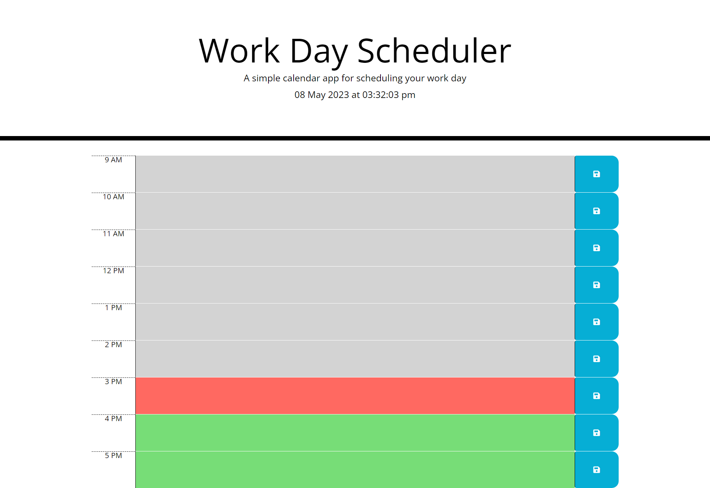

# Work Day Scheduler

## Description

The aim of this project was to create a fully functional work day scheduler using Javascript, Jquery, moment.js, Bootstrap CSS and HTML. With the assistance of HTML and CSS starter code, the work day scheduler portrays the current date and time, time blocks for standard business hours which are actively colour coded in regards to the current time, and a save button which saves events to local storage.

The features used to create this project consist of:
- Jquery
- Moment.js
- Bootstrap
- JS variables
- functions
- for loops
- conditional 'if' statements
- web API's
- local storage

The deployed application can be viewed through this link - https://bondt1.github.io/Work-Day-Scheduler/

## Installation

N/A

## Usage

The current date and time is portrayed at the top of the work day scheduler, followed by time blocks ranging from 9am to 5pm hourly. These time blocks are coloured depending on the current time - grey if it's time is in the past, red for present, and green for future. 

Simply type an event into these time blocks and click the blue save button to save your event to local storage. As a result, even if you refresh the work day scheduler, your event will remain on the time block. 

## Credits

N/A

## License

N/A